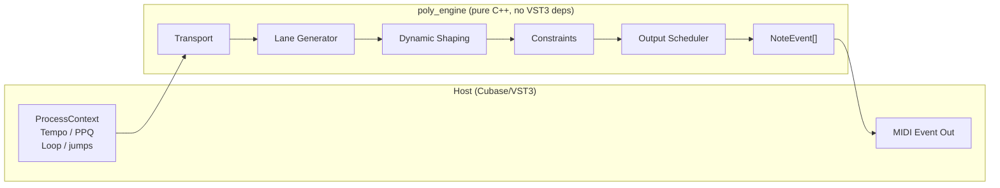

# Architecture

Poly is split into two layers with a strict isolation boundary:

- **`poly_engine`** -- pure C++ static library. Zero VST3 or audio-thread dependencies. Compiles and passes all tests without the SDK. Contains: Euclidean generator, envelopes, constraints, scenes, macros, phrase gating, mutation, drift, MIDI capture, and SMF writer.

- **`poly_plugin`** -- VST3 AudioEffect/Processor and EditController. Feeds transport and parameter state to the engine, drains `NoteEvent` output to the host's MIDI event list.

- **`tests/`** -- off-host unit tests, golden output determinism tests, UI interaction and visual regression tests.

Active work is tracked in the public
[GitHub milestones](https://github.com/JimAKennedy/poly/milestones) and
[CHANGELOG](CHANGELOG.md). [IMPLEMENTATION_PLAN.md](IMPLEMENTATION_PLAN.md)
is the archived Phase 0 planning document — useful as a historical record of
early design intent, not as a current-state reference.
