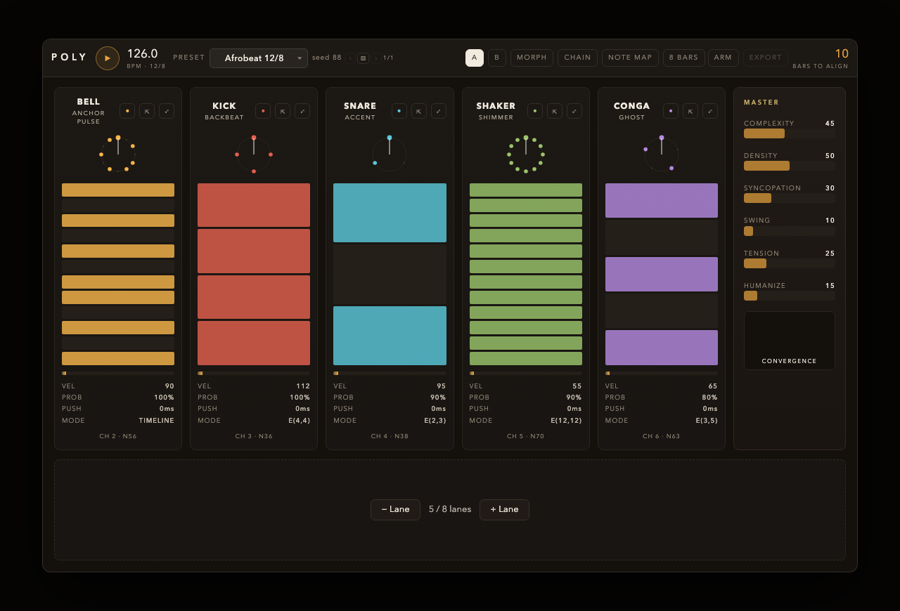

# Poly

Poly is a free, open-source polymetric drum sequencer for your DAW: grooves grounded in real drumming traditions, a guide that cites where every preset comes from, deterministic output, and an engine that runs in your browser.

[](https://github.com/JimAKennedy/poly/actions/workflows/ci.yml)
[](https://codecov.io/gh/JimAKennedy/poly)



Poly generates evolving polyrhythmic grooves from 4-8 independent rhythmic lanes.
Each lane runs its own cycle length and Euclidean pattern, creating interlocking
rhythms that shift and recombine over time. The plugin outputs MIDI note events to
your DAW -- no audio processing, just patterns.

- **Euclidean rhythms** -- each lane distributes pulses across its cycle using the Euclidean algorithm
- **Genre presets** -- West African, Afro-Cuban, Gamelan, Balkan, electronic, and more
- **Cross-rhythm visualization** -- real-time display of how lanes align and diverge
- **Envelope shaping** -- velocity curves driven by cycle phase and macro controls
- **Swing and humanize** -- per-lane timing offsets and velocity variation
- **MIDI capture and export** -- record generated patterns as Standard MIDI Files
- **Scene system** -- save and recall complete lane configurations
- **Macro controls** -- single-knob morphing across density, complexity, and energy

## Try it in the browser

The engine that runs in the plugin also runs in the guide's pages, compiled to
WebAssembly. Open the [Foundations chapter](https://poly.jk.digital/01-foundations/)
and press play on a pattern to hear Poly before installing anything; every
chapter's patch tables play the same way.

## Download

Download the `.zip` for your platform from a
[GitHub Release](https://github.com/JimAKennedy/poly/releases), unzip it, and
copy `poly_plugin.vst3` into your VST3 folder:

- **macOS** — `~/Library/Audio/Plug-Ins/VST3/` (per-user) or
  `/Library/Audio/Plug-Ins/VST3/` (all users)
- **Windows** — `C:\Program Files\Common Files\VST3\`
- **Linux** — no plugin zip is published. Poly is **engine/WASM-only** on Linux
  so there is no Linux VST3 to download — don't go looking for one in the
  GitHub Release. Build the engine locally with `-DPOLY_ENGINE_ONLY=ON` (see
  [Building](#building)).

On macOS and Windows the zip extracts to a top-level `poly_plugin.vst3/` bundle;
copy that whole bundle directory (not its loose contents) into the VST3 folder
above.

### macOS Gatekeeper (unsigned builds)

Release builds are signed and notarized by Apple **only when the maintainer has
provisioned the Developer ID signing secrets** (see
[RELEASING.md](RELEASING.md)). Until then the shipped
bundle is **unsigned**, so macOS attaches a quarantine flag to the downloaded
`.zip` and Gatekeeper blocks the plugin — Cubase silently drops it from the
scan, or you get a "cannot be opened because the developer cannot be verified"
dialog.

Clear the quarantine flag on the extracted bundle before copying it in:

```bash
xattr -dr com.apple.quarantine poly_plugin.vst3
```

`-d` deletes the attribute, `-r` recurses into the bundle. Once a signed +
notarized + stapled release ships, this step is unnecessary — Gatekeeper
accepts the stapled bundle with no prompt.

## DAW compatibility

| Host | Version | Platform | Status | Routing |
|---|---|---|---|---|
| Cubase | Pro 15 | macOS | supported | Instrument track for Poly; a drum instrument whose MIDI input is Poly on all channels, or a MIDI Send from the Poly track |
| Cubase | 14 | Windows | supported | The same; exercised nightly by the Cubase harness |
| Other VST3 hosts | — | — | untested | Routing MIDI out of a plugin is where hosts differ most; nothing has been measured |

Poly is built and tested in Cubase. Other hosts may work and have not been
tried; a measured host table for them is planned.

**Logic Pro is not supported.** Logic routes generated MIDI only from a
MIDI-FX Audio Unit, and Poly's Audio Unit is an instrument built by the VST3
SDK's wrapper, which cannot produce one; the Audio Unit is built in CI for
validation and is not part of any release.

## Guide

**[poly.jk.digital](https://poly.jk.digital)** -- the full guide covering polyrhythmic
traditions, Euclidean rhythm theory, and how to use Poly's preset system. Source is in `site/`.

## Contributing

Contributions are welcome. Start here:

- **[ROADMAP.md](ROADMAP.md)** — the public roadmap grouping open work by
  theme, each linking its live issue query, so you can see where the project is headed.
- **[CONTRIBUTING.md](CONTRIBUTING.md)** — prerequisites, build setup, code
  style, real-time safety rules, and the fork-branch-PR workflow.
- **[docs/README.md](docs/README.md)** — which documents under `docs/` are for
  you, and which are delivery records you can leave alone.
- **[Good first issues](https://github.com/JimAKennedy/poly/issues?q=is%3Aissue+is%3Aopen+label%3A%22good+first+issue%22)**
  — scoped, self-contained tasks that are reviewable without deep engine
  context. The best place to make a first contribution.

Maintainers cutting a release: see [RELEASING.md](RELEASING.md).

## Building

Requires CMake 3.14+ and a C++20 compiler (Clang, GCC, or MSVC).

```bash
cmake -S . -B build -G Ninja -DCMAKE_BUILD_TYPE=Release
cmake --build build
```

The VST3 SDK is fetched automatically via CMake FetchContent.

### Run tests

```bash
ctest --test-dir build --output-on-failure
```

### Engine-only build (no VST3 SDK)

The engine is a standalone C++ library with zero VST3 dependencies:

```bash
cmake -S . -B build -G Ninja -DPOLY_ENGINE_ONLY=ON
cmake --build build
```

This is the only supported Linux build. Poly ships as a plugin on **macOS and
Windows** only. Linux is an
**engine/WASM-only** target: the `poly_engine` library compiles and its tests
run on Linux (and the engine cross-compiles to WebAssembly for the web guide),
but no shipping Linux VST3 is built. Rebuilding on Linux gives you a fast
engine-only compile with no VST3 SDK or UI dependencies — use
`-DPOLY_ENGINE_ONLY=ON` as shown above.

The Linux CI leg is therefore an engine/WASM portability compile rather than
a full plugin build; see `CHANGELOG.md` for the scope statement.

## Architecture

The core engine (`poly_engine`) is isolated from the plugin layer (`poly_plugin`).
The engine compiles and passes all tests without the VST3 SDK. The plugin feeds
transport and parameter state to the engine and drains its `NoteEvent` output to
the DAW's MIDI event list.

For current architecture see `ARCHITECTURE.md`. The roadmap is [ROADMAP.md](ROADMAP.md),
planned work is the delivery ledgers under `docs/plans/`, and shipped work is
`CHANGELOG.md`. `IMPLEMENTATION_PLAN.md` is archived Phase 0 planning kept for
historical context only.

## License

[GPLv3](LICENSE). Copyright 2024-2026 Jim Kennedy.
